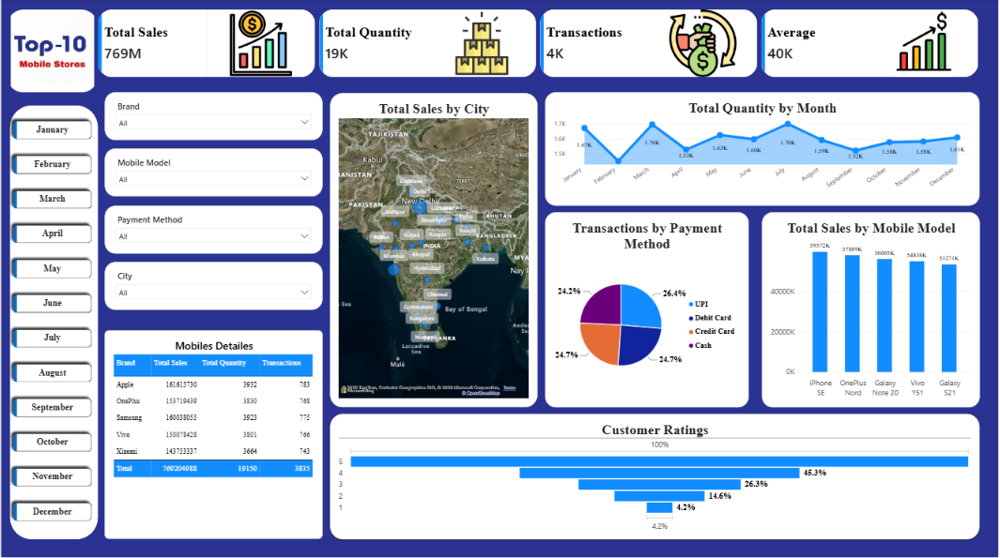

# Mobile-Sales-Powerbi-Dashboard

This Power BI project analyzes mobile phone sales performance across cities, brands, models, months, payment methods, transactions, and customer ratings.

## 🎯 Objectives
- Analyze overall mobile sales performance
- Track total sales and quantity
- Understand transaction trends
- Compare mobile brands and models
- Analyze sales across different cities
- Identify popular payment methods
- Monitor customer ratings
- Understand monthly sales and quantity trends

## 🛠️ Tools & Technologies
- Power BI
- Microsoft Excel / CSV
- Data Cleaning
- Data Visualization
- Data Analysis
- DAX

## 📌 Key KPIs
| KPI | Value |
| Total Sales | 769M |
| Total Quantity | 19K |
| Transactions | 4K |
| Average Sales | 40K |

## 📈 Dashboard Features

### Sales Analysis
- Total sales by city
- Sales by mobile model
- Sales by brand
- Monthly sales performance

### Quantity Analysis
- Monthly quantity trend
- Quantity by mobile model
- Quantity by brand

### Transaction Analysis
- Total transactions
- Transactions by payment method

### Customer Analysis
- Customer rating distribution
- Rating-based performance analysis

### Filters

The dashboard includes interactive filters for:
- Month
- Brand
- Mobile Model
- Payment Method
- City

## 📷 Dashboard Preview



## 🔍 Key Insights
- The dashboard tracks approximately 769M in total sales.
- Approximately 19K mobile units were sold.
- The analysis covers around 4K transactions.
- Mobile models can be compared based on their sales performance.
- Payment methods can be analyzed through transaction distribution.
- Customer ratings provide additional insight into customer satisfaction.
- Monthly analysis helps identify changes in sales and quantity throughout the year.

## 📁 Project Structure

```text
mobile-sales-powerbi-dashboard/
│
├── README.md
│
├── dashboard/
│   └── Mobile_Sales_Dashboard.pbix
│
├── images/
│   └── Mobile_Sales_Dashboard.png
│
├── data/
│   └── mobile_sales_data.csv

🚀 How to Use
Download or clone this repository.
Open the .pbix file using Microsoft Power BI Desktop.
Review the dashboard pages and interactive filters.
Use the filters to explore different brands, models, cities, months, and payment methods.

👨‍💻 Skills Demonstrated
Data Analysis
Power BI Dashboard Development
Data Visualization
KPI Development
Interactive Filtering
Business Intelligence
DAX
Data Storytelling

📄 License
This project is created for educational and portfolio purposes.
